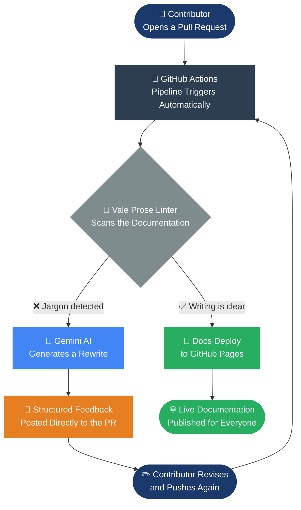
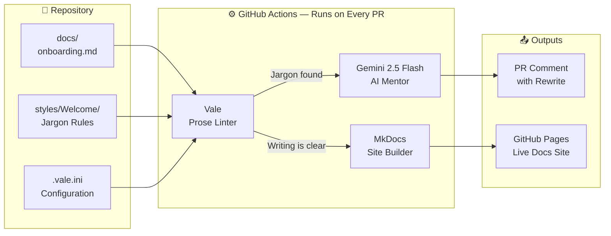

<div align="center">

# Invisible Mentors

### *Every contributor deserves instant feedback. Every maintainer deserves their time back.*

[](https://github.com/saisravan909/Invisible-Mentors/actions/workflows/invisible-mentor.yml)
[](https://github.com/saisravan909/Invisible-Mentors/actions/workflows/main.yml)
[](https://opensource.org/licenses/MIT)
[](https://vale.sh)
[](https://aistudio.google.com)
[](https://python.org)
[](https://saisravan909.github.io/Invisible-Mentors)
[](https://github.com/saisravan909/Invisible-Mentors/pulls)
[](https://github.com/saisravan909/Invisible-Mentors/commits/main)

**[View Live Docs →](https://saisravan909.github.io/Invisible-Mentors)** &nbsp;·&nbsp; **[See How It Works →](#how-it-works)** &nbsp;·&nbsp; **[Try It Yourself →](#get-it-in-your-project)**

</div>

---

## The Problem Nobody Talks About

Picture your best engineer. Now picture them spending three hours every Friday reading documentation pull requests — correcting the same jargon, fixing the same passive voice, repeating the same feedback they wrote the week before.

That is not mentoring. That is burnout with extra steps.

Open source projects lose contributors every day — not because the code is hard, but because the feedback loop is slow, inconsistent, and entirely dependent on human availability. A newcomer submits their first pull request on a Tuesday, waits four days for a review, receives a terse comment saying "please rewrite this," and never comes back.

**The bottleneck is never the code. It is the people reviewing it.**

---

## The Solution

**Invisible Mentors** is a production-ready automation pipeline that reads every pull request the moment it lands, scans for jargon and unclear writing, and posts structured, human-quality feedback — before a single maintainer has to look.

The feedback is immediate. The tone is constructive. The maintainer's time is protected.

> *"The Mentor is invisible. The impact is not."*

---

## How It Works



In plain terms:

1. A contributor opens a Pull Request with a documentation change
2. The pipeline runs automatically — no one presses a button
3. Vale scans the writing for corporate jargon and passive voice
4. If jargon is found, Gemini AI generates a clean rewrite and posts it as a PR comment
5. The contributor fixes it and pushes again
6. The docs deploy automatically to the live site

**No human is needed until the writing is already clean.**

---

## What the Mentor Catches

The pipeline is built around a simple principle: documentation should read like a person wrote it, not a committee approved it.

| ❌ What Gets Flagged | ✅ What the Mentor Suggests |
|:---|:---|
| "Please **utilize** our setup script" | "Please **use** our setup script" |
| "**Leverage** the existing infrastructure" | "**Use** what is already in place" |
| "Align with our **paradigms**" | "Follow our approach" |
| "Enable **synergistic** collaboration" | "Work together" |
| "**Operationalize** the workflow" | "Run the workflow" |

These are not cosmetic fixes. Jargon is the single biggest reason new contributors feel excluded from open source. When documentation reads like a corporate memo, it signals a closed community. Clear writing signals a welcoming one.

---

## The Full Pipeline



---

## The Technology Stack

| Layer | Technology | Purpose |
|:---|:---|:---|
| **Version Control** | GitHub | Source of truth for all code and documentation |
| **CI/CD Automation** | GitHub Actions | Runs the full pipeline on every pull request |
| **Prose Linting** | [Vale](https://vale.sh) | Flags jargon, passive voice, and unclear language |
| **AI Feedback** | Gemini 2.5 Flash | Reads flagged text and generates a human rewrite |
| **Documentation Site** | MkDocs Material | Renders a fast, searchable, beautiful docs site |
| **Hosting** | GitHub Pages | Publishes the live site automatically after every clean merge |

Every component is open source. Every credential is stored securely as a GitHub Secret. No vendor lock-in. No monthly platform fees beyond a standard GitHub account.

---

## The Business Case

This is not a developer productivity tool. It is an organizational force multiplier.

- **One maintainer** can support **ten times more contributors** without increasing review hours
- **New contributors** receive feedback in seconds, not days — dramatically improving first-PR completion rates
- **Documentation quality** is enforced automatically, reducing downstream support burden
- **Every Pull Request** carries a built-in audit trail — no separate compliance tooling required
- **Zero infrastructure cost** — runs on GitHub's CI/CD tier at no additional charge for public repositories

The return is not theoretical. It is measurable in maintainer hours recovered and contributors retained.

---

## Live Demo

This repository *is* the demo. Here is exactly what happens when a contributor opens a pull request with jargon in the docs.

**The contributor writes this:**
```markdown
We encourage you to utilize our setup script to leverage the latest paradigms.
```

**Vale catches it in seconds:**
```
docs/onboarding.md
 3:28  warning  Use 'use' instead of 'utilize'    Welcome.Jargon
 3:51  warning  Use 'use' instead of 'leverage'   Welcome.Jargon
 3:70  warning  Avoid 'paradigms'                 Welcome.Jargon

✖ 3 warnings
```

**The Invisible Mentor posts this to the PR:**

> **Invisible Mentor — Jargon Audit**
>
> | Line | Original | Suggested Revision | Reason |
> |:---|:---|:---|:---|
> | 3 | "utilize our setup script" | "use our setup script" | 'Utilize' adds syllables without adding meaning |
> | 3 | "leverage the latest paradigms" | "use the latest approach" | Jargon creates distance from the reader |
>
> *Revise the flagged phrases and push again — the mentor will re-check automatically.*

**The contributor fixes it. The docs deploy. The maintainer was never paged.**

---

## Get It In Your Project

```bash
# Clone and explore
git clone https://github.com/saisravan909/Invisible-Mentors.git
cd Invisible-Mentors

# Run Vale locally (requires Vale CLI — https://vale.sh)
vale docs/

# Run the AI Mentor locally (requires a free Gemini API key)
export GEMINI_API_KEY="your-key-from-aistudio.google.com"
python ai_mentor.py --file docs/onboarding.md
```

**To bring this pipeline into your own project — copy four files:**

```
.github/workflows/invisible-mentor.yml   ← The PR-check pipeline
styles/Welcome/                          ← The jargon ruleset
.vale.ini                                ← Linter configuration
ai_mentor.py                             ← The AI mentor script
```

Then add `GEMINI_API_KEY` as a GitHub repository secret. Open a PR with jargon in the docs. The mentor will respond.

---

<div align="center">

## Presented At

**Linux Foundation Open Source Summit · May 2026**

*"Architecting for Onboarding: Building a Docs-as-Code Pipeline for Open Source Sustainability"*

<br>

**Sai Sravan Cherukuri**
*Enterprise Modernization Architect · Platform Engineer*

<br>

[](https://saisravan909.github.io/Invisible-Mentors)

<br>

*MIT Licensed · Built for the global open source community · No platforms. No fees. Just better docs.*

</div>
