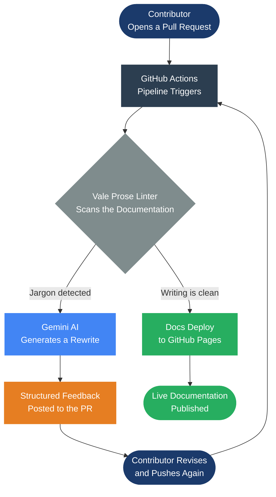

<div align="center">


# Invisible Mentors

### *Every contributor deserves instant feedback. Every maintainer deserves their time back.*

[](https://github.com/saisravan909/Invisible-Mentors/actions/workflows/invisible-mentor.yml)
[](https://github.com/saisravan909/Invisible-Mentors/actions/workflows/main.yml)
[](https://opensource.org/licenses/MIT)
[](https://vale.sh)
[](https://aistudio.google.com)
[](https://python.org)
[](https://saisravan909.github.io/Invisible-Mentors)
[](https://github.com/saisravan909/Invisible-Mentors/pulls)
[](https://github.com/saisravan909/Invisible-Mentors/commits/main)

**[View Live Docs](https://saisravan909.github.io/Invisible-Mentors)** &nbsp;·&nbsp; **[See How It Works](#how-it-works)** &nbsp;·&nbsp; **[Try It Yourself](#get-it-in-your-project)**

</div>

---

## The Problem

Think about how most open source documentation reviews actually work. Someone opens a pull request, a maintainer reads through it a few days later, leaves a comment asking for rewrites, and the contributor either fixes it or quietly disappears.

The same corrections come up over and over again: jargon that sounds impressive but says nothing, passive voice that buries the action, sentences that take three reads to parse. Reviewers know this pattern well because they have been writing the same feedback for months.

That kind of review is not mentoring. It is repetitive work that burns people out and slows down projects that should be growing.

The real problem is timing. By the time a maintainer looks at a PR, a contributor has already moved on mentally. Slow feedback breaks the loop.

---

## What This Project Does

Invisible Mentors runs automatically on every pull request. The moment someone opens a PR, a GitHub Actions pipeline scans the documentation changes with [Vale](https://vale.sh), a prose linter configured with a custom jargon ruleset. If the writing is clean, the docs deploy. If there are issues, [Gemini AI](https://aistudio.google.com) reads the flagged passages and posts a structured comment directly to the PR with specific rewrites suggested.

The contributor gets feedback in seconds. The maintainer does not have to read it first.

---

## How It Works



When a PR comes in:

1. Vale checks every `.md` file in `docs/` against a custom ruleset that flags jargon words and patterns
2. If everything passes, the docs build and deploy to GitHub Pages automatically
3. If jargon is found, Gemini 2.5 Flash reads the flagged text and generates a plain-English rewrite
4. That rewrite gets posted as a comment on the PR with a table showing exactly what changed and why

The contributor sees the comment, fixes the flagged lines, and pushes again. The cycle repeats until the writing is clean.

---

## What Vale Catches

The ruleset flags words that tend to obscure meaning rather than clarify it:

| Word or Phrase | Why It Gets Flagged | What to Write Instead |
|:---|:---|:---|
| leverage | Vague business-speak for "use" | use, apply, build on |
| utilize | A longer word for "use" with no added meaning | use |
| paradigm | Rarely means anything specific in docs | approach, model, pattern |
| synergy / synergize | Abstract and hard to act on | working together, collaboration |
| innovative solution | Filler phrase that adds no information | just describe what it does |

---

## Get It In Your Project

```bash
# Clone and explore
git clone https://github.com/saisravan909/Invisible-Mentors.git
cd Invisible-Mentors

# Run Vale locally (requires Vale CLI — https://vale.sh)
vale docs/

# Run the AI mentor locally (requires a free Gemini API key)
export GEMINI_API_KEY="your-key-from-aistudio.google.com"
python ai_mentor.py --file docs/onboarding.md
```

To bring this into your own project, copy four files:

```
.github/workflows/invisible-mentor.yml   # the PR-check pipeline
styles/Welcome/                          # the jargon ruleset
.vale.ini                                # linter configuration
ai_mentor.py                             # the AI mentor script
```

Then add `GEMINI_API_KEY` as a repository secret. Open a PR with some jargon in the docs and watch what happens.

---

<div align="center">

## Presented At

**Linux Foundation Open Source Summit · May 2026**

*"Architecting for Onboarding: Building a Docs-as-Code Pipeline for Open Source Sustainability"*

<br>

**Sai Sravan Cherukuri**
*Enterprise Modernization Architect · Platform Engineer*

<br>

[](https://saisravan909.github.io/Invisible-Mentors)

<br>

*MIT Licensed · Built for the open source community · No platforms. No fees. Just better docs.*

</div>
