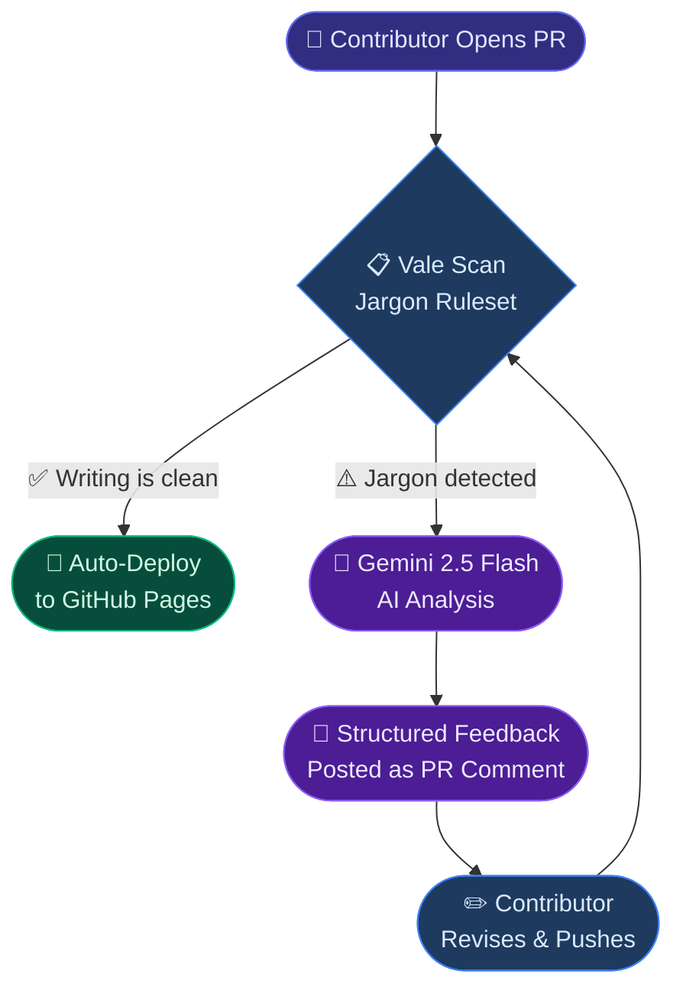
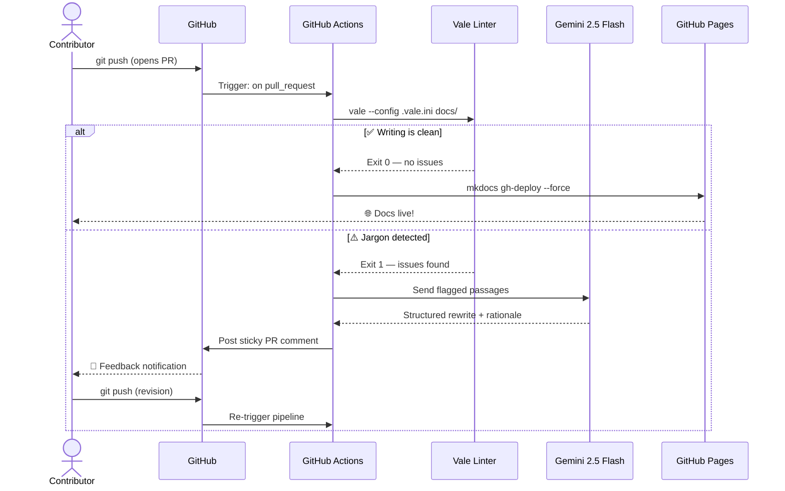
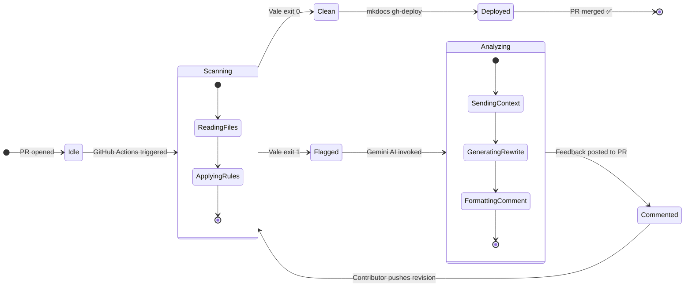

<div class="hero-section" markdown>


<p class="hero-tagline">
  Every contributor deserves instant feedback.<br>
  Every maintainer deserves their time back.
</p>

<div class="hero-buttons" markdown>

[View on GitHub :fontawesome-brands-github:](https://github.com/saisravan909/Invisible-Mentors){ .md-button .md-button--primary }
[Live Demo :material-presentation:](https://im.saisravancherukuri.com){ .md-button }
[Try It Now :material-play-circle:](#try-it-yourself){ .md-button }

</div>

</div>

---

## The Problem Nobody Talks About

Open source projects thrive when contributors feel supported. But as a project grows, so does the documentation review burden. Maintainers spend hours each week reading pull requests — correcting the same jargon, fixing the same passive voice, repeating the same feedback they wrote the week before.

!!! danger "The Bottleneck"
    The maintainer becomes the bottleneck. Not because of bad contributors — but because there's no automated layer between **"a draft was submitted"** and **"it's ready to merge"**.

**Invisible Mentors removes that bottleneck entirely.**

---

## How It Works

Every pull request runs through a two-layer automated pipeline — no human reviewer needed until the writing is already clean.



!!! success "The result"
    A contributor gets expert-level writing feedback in **under 30 seconds** — faster than any human reviewer could open the tab.

---

## Core Features

<div class="grid cards" markdown>

-   :material-shield-check:{ .lg .middle } **Zero-Config Mentorship**

    ---

    Runs automatically on every PR via GitHub Actions. No setup per contributor, no accounts, no friction.

-   :material-robot:{ .lg .middle } **Gemini 2.5 Flash AI**

    ---

    When jargon is detected, Gemini generates a structured rewrite with context, alternative phrases, and rationale — not just a flag.

-   :material-file-search:{ .lg .middle } **Vale Prose Linting**

    ---

    Custom ruleset targets corporate buzzwords: *leverage*, *utilize*, *paradigm*, *synergy* — caught before they reach `main`.

-   :fontawesome-brands-github:{ .lg .middle } **Native GitHub Integration**

    ---

    Feedback posts as a sticky PR comment. Contributors never leave GitHub. No webhooks, no external dashboards.

-   :material-timer-outline:{ .lg .middle } **30-Second Feedback Loop**

    ---

    Scan → analyze → comment. The entire pipeline runs in under 30 seconds from push to feedback.

-   :material-open-source-initiative:{ .lg .middle } **100% Open Source**

    ---

    MIT licensed. Fork it, adapt it, make it your own. Built to be shared with the entire open source community.

</div>

---

## Architecture Deep Dive

### Request / Response Flow



### Pipeline States



---

## Technology Stack

=== ":material-robot: AI Layer"

    | Component | Detail |
    |:---|:---|
    | **Model** | Gemini 2.5 Flash |
    | **Provider** | Google AI Studio |
    | **SDK** | `google-genai` (Python) |
    | **Output** | Structured Markdown table in PR comment |
    | **Trigger** | Only when Vale detects jargon |

=== ":material-file-search: Linting Layer"

    | Component | Detail |
    |:---|:---|
    | **Tool** | Vale v3.7.0 |
    | **Config** | `.vale.ini` at repo root |
    | **Rules** | Custom jargon ruleset in `vale-styles/` |
    | **Scope** | All `.md` files under `docs/` |
    | **Exit code** | `0` = clean, `1` = issues found |

=== ":fontawesome-brands-github: CI/CD Layer"

    | Component | Detail |
    |:---|:---|
    | **Platform** | GitHub Actions |
    | **Trigger** | `on: push` to `main`, `on: pull_request` |
    | **Docs deploy** | `mkdocs gh-deploy --force` |
    | **Hosting** | GitHub Pages (`gh-pages` branch) |
    | **Permissions** | `contents: write` for Pages deploy |

---

## By the Numbers

<div class="stats-grid" markdown>

<div class="stat-card" markdown>
<span class="stat-number">< 30s</span>
<span class="stat-label">Feedback delivered</span>
</div>

<div class="stat-card" markdown>
<span class="stat-number">2-Layer</span>
<span class="stat-label">Automated review pipeline</span>
</div>

<div class="stat-card" markdown>
<span class="stat-number">0</span>
<span class="stat-label">Human reviewers needed</span>
</div>

<div class="stat-card" markdown>
<span class="stat-number">MIT</span>
<span class="stat-label">Open source license</span>
</div>

</div>

---

## Try It Yourself

!!! tip "Fork & Test in 3 Steps"

    **1. Fork the repository**
    ```bash
    # Click "Fork" on GitHub, then clone your fork
    git clone https://github.com/YOUR-USERNAME/Invisible-Mentors.git
    cd Invisible-Mentors
    ```

    **2. Add jargon to a doc**
    ```bash
    echo "\n\nWe need to leverage our existing paradigms to synergize outcomes." \
      >> docs/onboarding.md
    git add docs/onboarding.md
    git commit -m "test: add jargon for demo"
    git push origin main
    ```

    **3. Open a Pull Request**

    Watch the GitHub Actions pipeline run, Vale flag the jargon, and Gemini AI post a structured rewrite — all within 30 seconds.

    [Fork on GitHub :fontawesome-brands-github:](https://github.com/saisravan909/Invisible-Mentors/fork){ .md-button .md-button--primary .fork-button }

---

!!! info "Presented at Linux Foundation Open Source Summit · May 2026"
    Invisible Mentors was built to solve a real problem faced by every growing open source project: **maintainer burnout from documentation review**. By fully automating the mentorship loop, maintainers reclaim their time and contributors get expert feedback instantly.

    *Built by **Sai Sravan Cherukuri** — Enterprise Modernization Architect*
