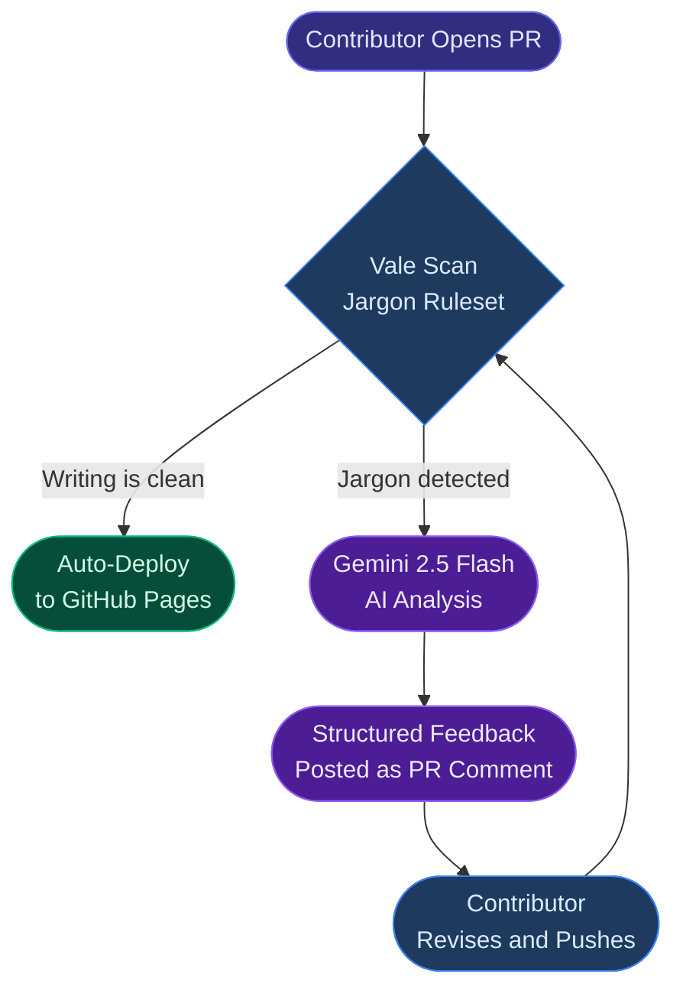
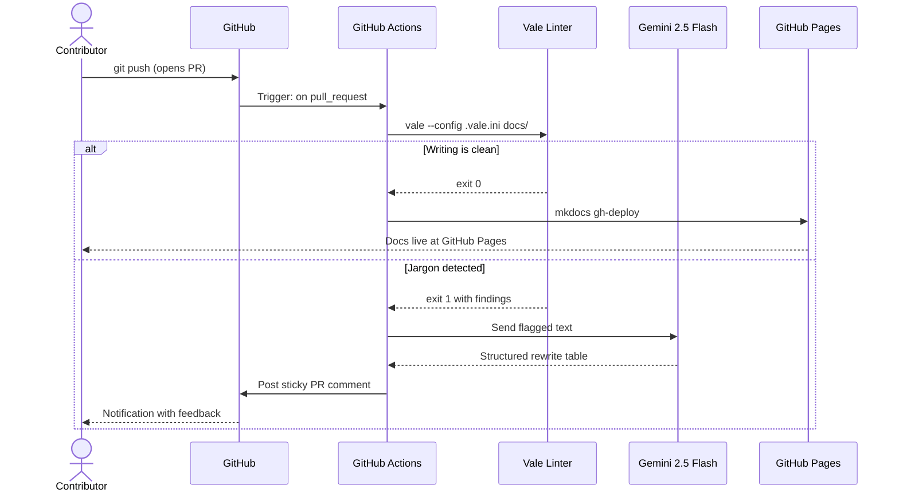

<div class="hero-section" markdown>


<p class="hero-tagline">
  Every contributor deserves instant feedback.<br>
  Every maintainer deserves their time back.
</p>

<div class="hero-buttons" markdown>

[View on GitHub :fontawesome-brands-github:](https://github.com/saisravan909/Invisible-Mentors){ .md-button .md-button--primary }
[Live Demo :material-presentation:](https://im.saisravancherukuri.com){ .md-button }
[Try It Now :material-play-circle:](#try-it-yourself){ .md-button }

</div>

</div>

---

## The Problem

Open source projects grow when contributors feel supported. But as a project grows, so does the documentation review burden. Maintainers end up spending hours each week going through pull requests, correcting the same jargon, fixing the same writing patterns, and leaving feedback they wrote a dozen times before.

!!! warning "Where projects stall"
    The maintainer becomes the bottleneck. Not because contributors write badly, but because there is no automated layer between "a draft was submitted" and "it is ready to merge."

**Invisible Mentors fills that gap.**

---

## How It Works

Every pull request runs through a two-layer automated pipeline. No human reviewer is needed until the writing is already clean.



!!! success "What this means in practice"
    A contributor gets detailed writing feedback in **under 30 seconds**, well before any maintainer has had a chance to open the PR.

---

## Core Features

<div class="grid cards" markdown>

-   :material-shield-check:{ .lg .middle } **Runs on Every PR Automatically**

    ---

    Triggered by GitHub Actions on each pull request. No per-contributor setup, no accounts, no friction.

-   :material-robot:{ .lg .middle } **Gemini 2.5 Flash**

    ---

    When jargon is detected, Gemini reads the flagged text and generates a structured rewrite with alternatives and context, not just a flag.

-   :material-file-search:{ .lg .middle } **Vale Prose Linting**

    ---

    Custom ruleset catches corporate buzzwords before they land in your docs: *leverage*, *utilize*, *paradigm*, *synergy*.

-   :fontawesome-brands-github:{ .lg .middle } **Native GitHub Integration**

    ---

    Feedback posts as a sticky PR comment. Contributors stay in GitHub. No webhooks, no external dashboards to manage.

-   :material-timer-outline:{ .lg .middle } **30-Second Feedback Loop**

    ---

    Scan, analyze, comment. The full pipeline runs in under 30 seconds from push to feedback.

-   :material-open-source-initiative:{ .lg .middle } **MIT Licensed**

    ---

    Fork it, adapt it, make it your own. Built to be shared with anyone who wants it.

</div>

---

## Architecture

### Request / Response Flow



---

<div class="stats-grid" markdown>

<div class="stat-card" markdown>
<span class="stat-number">28s</span>
<span class="stat-label">Average time to first feedback</span>
</div>

<div class="stat-card" markdown>
<span class="stat-number">2-Layer</span>
<span class="stat-label">Automated review pipeline</span>
</div>

<div class="stat-card" markdown>
<span class="stat-number">0</span>
<span class="stat-label">Human reviewers needed</span>
</div>

<div class="stat-card" markdown>
<span class="stat-number">MIT</span>
<span class="stat-label">Open source license</span>
</div>

</div>

---

## Try It Yourself

!!! tip "Fork and test in 3 steps"

    **1. Fork the repository**
    ```bash
    # Click "Fork" on GitHub, then clone your fork
    git clone https://github.com/YOUR-USERNAME/Invisible-Mentors.git
    cd Invisible-Mentors
    ```

    **2. Add jargon to a doc**
    ```bash
    echo "\n\nWe need to leverage our existing paradigms to synergize outcomes." \
      >> docs/onboarding.md
    git add docs/onboarding.md
    git commit -m "test: add jargon for demo"
    git push origin main
    ```

    **3. Open a Pull Request**

    Watch the pipeline run, Vale flag the jargon, and Gemini post a structured rewrite directly to your PR, all within 30 seconds.

    [Fork on GitHub :fontawesome-brands-github:](https://github.com/saisravan909/Invisible-Mentors/fork){ .md-button .md-button--primary .fork-button }

---

!!! info "Presented at Linux Foundation Open Source Summit, May 2026"
    This project was built to address a real issue that comes up in almost every growing open source project: maintainers spending too much time on documentation review. Automating that feedback loop lets maintainers focus on work only they can do, and gives contributors a faster path to getting their changes merged.

    *Built by **Sai Sravan Cherukuri***
