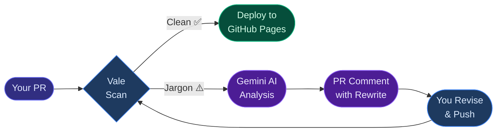

# Contributor Guide

Welcome to **Invisible Mentors**. This guide explains how to contribute documentation improvements, how the automated pipeline reviews your work, and what to do when you receive feedback.

!!! abstract "Quick Summary"
    Every pull request is reviewed automatically. If your writing is clear and jargon-free, your docs deploy instantly. If jargon is detected, Gemini AI posts structured feedback directly to your PR — no waiting, no guessing.

---

## Before You Start

### Prerequisites

- [ ] A GitHub account
- [ ] `git` installed locally
- [ ] Basic familiarity with Markdown
- [ ] (Optional) Python 3.10+ and `mkdocs-material` for local preview

### Fork and Clone

```bash
# 1. Fork the repo via GitHub, then clone your fork
git clone https://github.com/YOUR-USERNAME/Invisible-Mentors.git
cd Invisible-Mentors

# 2. Create a feature branch
git checkout -b docs/improve-onboarding

# 3. (Optional) Set up local preview
pip install mkdocs-material
mkdocs serve
# → Preview at http://localhost:8000
```

---

## Understanding the Pipeline

When you open a pull request, this is exactly what happens:



!!! info "What Vale checks for"
    Vale scans all `.md` files in `docs/` against a custom jargon ruleset. The following words and phrases are flagged:

    | Jargon | Better Alternative |
    |:---|:---|
    | leverage | use |
    | utilize | use |
    | paradigm | approach, model, pattern |
    | synergy / synergize | collaboration, working together |
    | leverage existing infrastructure | use what's already there |
    | innovative solution | solution (drop the filler) |

---

## Making Your First Contribution

### Step 1 — Edit a Document

All contributor-facing documentation lives in `docs/`. Make your edits in Markdown:

```bash
# Example: improve the onboarding guide
nano docs/onboarding.md

# Or edit any file in docs/
ls docs/
```

### Step 2 — Preview Locally (Optional)

```bash
mkdocs serve
```

Open `http://localhost:8000` to see your changes rendered with the full Material theme, including Mermaid diagrams.

### Step 3 — Commit and Push

```bash
git add docs/
git commit -m "docs: improve contributor onboarding guide"
git push origin docs/improve-onboarding
```

### Step 4 — Open a Pull Request

Open your pull request on GitHub. Within seconds, the Invisible Mentor pipeline triggers automatically.

---

## Reading AI Feedback

If Vale detects jargon, Gemini AI will post a comment like this to your PR:

!!! example "Sample AI Feedback Comment"
    ```
    ## 🤖 Invisible Mentor — Jargon Audit

    | # | Location | Flagged Phrase | Suggested Rewrite | Reason |
    |---|----------|---------------|-------------------|--------|
    | 1 | onboarding.md:14 | "leverage existing paradigms" | "use existing approaches" | Avoid corporate buzzwords |
    | 2 | onboarding.md:22 | "synergize outcomes" | "improve results together" | Overly abstract |

    **Revise the flagged passages and push a new commit to re-run the check.**
    ```

Read the table, update the flagged lines, and push again. The pipeline re-runs automatically.

---

## Writing Style Guide

Follow these principles to pass the Vale check on your first try:

=== ":white_check_mark: Do"

    - Write in plain English — say what you mean directly
    - Use active voice: *"The pipeline checks your PR"* not *"Your PR is checked by the pipeline"*
    - Use specific, concrete words instead of vague qualifiers
    - Keep sentences under 25 words when possible
    - Define technical terms the first time you use them

=== ":x: Don't"

    - Use corporate buzzwords: leverage, utilize, synergize, paradigm
    - Start sentences with "In order to" (write "To" instead)
    - Use passive voice as a default
    - Pad sentences with filler: "innovative", "cutting-edge", "world-class"
    - Write walls of text — break things up with lists and headers

---

## Project Structure

```
Invisible-Mentors/
├── docs/                    # ← All documentation (what Vale checks)
│   ├── index.md             # Home page
│   ├── onboarding.md        # This guide
│   ├── assets/              # Images, logo
│   └── stylesheets/         # Custom CSS
├── vale-styles/             # Custom Vale jargon rules
│   └── Jargon/
│       └── jargon.yml
├── .vale.ini                # Vale configuration
├── mkdocs.yml               # Docs site configuration
├── ai_mentor.py             # Gemini AI integration script
├── mentor_persona.txt       # AI persona definition
└── .github/
    └── workflows/
        ├── main.yml         # Docs lint + deploy (on push to main)
        └── invisible-mentor.yml  # PR review pipeline
```

---

## Demo: The Pipeline in Action

The `docs/onboarding.md` file intentionally contains jargon below — this is what gets flagged during a live conference demo.

!!! warning "Live Demo Zone"
    The following section contains jargon that Vale **will** catch. This is intentional — it demonstrates the pipeline's detection capability live at conferences.

---

### Legacy Onboarding Content (Demo Zone)

We need to utilize our existing toolchain to leverage the paradigms established in the current architecture. By synergizing our documentation efforts with the development workflow, we can ensure that all stakeholders are aligned with the strategic objectives.

The implementation utilizes a multi-layered approach to paradigm enforcement, ensuring that contributors can leverage the full potential of the Vale ruleset while synergizing their contributions with the existing codebase.

---

!!! tip "Need Help?"
    Open a [GitHub Discussion](https://github.com/saisravan909/Invisible-Mentors/discussions) or check the [project README](https://github.com/saisravan909/Invisible-Mentors#readme) for more context.
